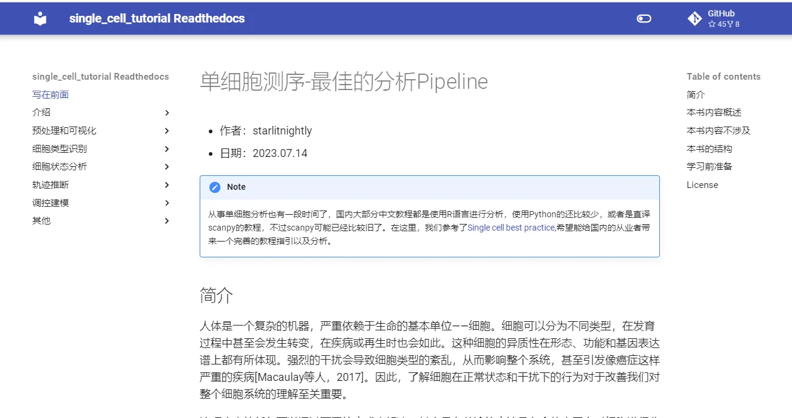
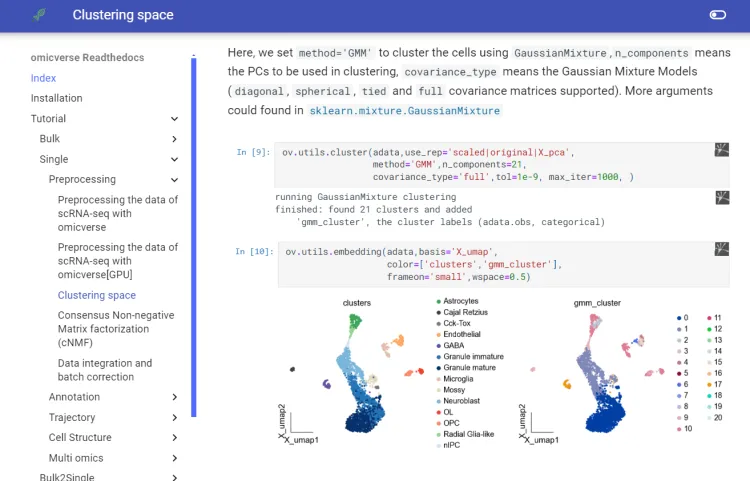
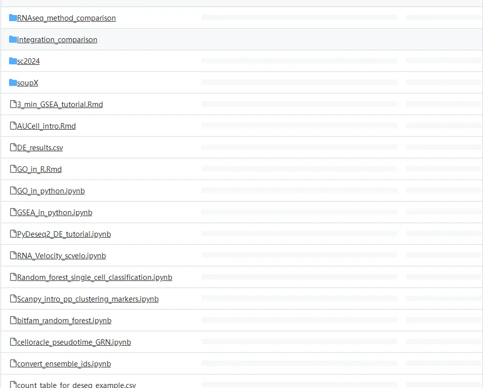
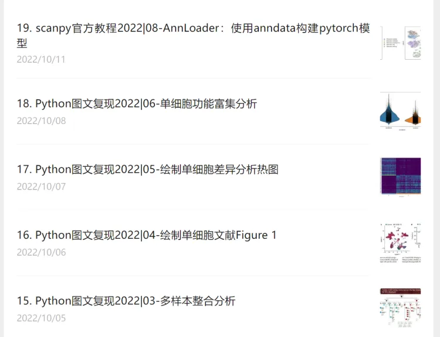
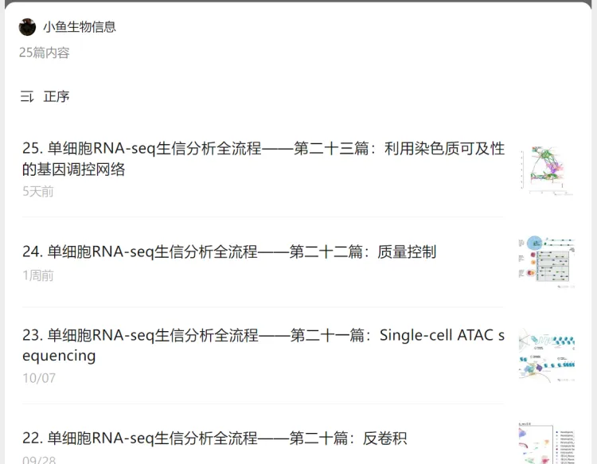

# 单细胞电子书教程
## 单细胞R版教程

## 单细胞python版教程
[单细胞测序-最佳的分析Pipeline](https://single-cell-tutorial.readthedocs.io/zh/latest/)

[Python单细胞分析流程](https://mp.weixin.qq.com/mp/appmsgalbum?__biz=MzI1Njk4ODE0MQ==&action=getalbum&album_id=3043199957647917063&scene=173&subscene=&sessionid=svr_dce1dd76296&enterid=1730556345&from_msgid=2247514538&from_itemidx=1&count=3&nolastread=1#wechat_redirect)

## omicverse
https://github.com/Starlitnightly/omicverse
https://starlitnightly.github.io/omicverse/Installation_guild/

## Single-cell best practices#

https://www.sc-best-practices.org/preamble.html
[sanbomics_scripts](https://links.jianshu.com/go?to=https%3A%2F%2Fgithub.com%2Fmousepixels%2Fsanbomics_scripts)
mousepixels/sanbomics_scripts   

视频如下：https://www.youtube.com/watch?v=uvyG9yLuNSE

代码：https://github.com/mousepixels/sanbomics_scripts

●主代码：https://github.com/mousepixels/sanbomics_scripts/blob/main/single_cell_analysis_complete_class.ipynb
[Python单细胞复现2022||04-绘制Figure 1](https://www.jianshu.com/p/08618abf7942)

## 小鬼的单细胞分析
https://mp.weixin.qq.com/mp/appmsgalbum?__biz=MzI1Njk4ODE0MQ==&action=getalbum&album_id=2269127976598454278&scene=173&subscene=&sessionid=svr_a4522ca392c&enterid=1730556480&from_msgid=2247506131&from_itemidx=1&count=3&nolastread=1#wechat_redirect

https://www.jianshu.com/nb/47783493

## 单细胞RNA-seq生信分析全流程
https://mp.weixin.qq.com/mp/appmsgalbum?__biz=Mzk0ODUxOTMyNw==&action=getalbum&album_id=3085238223700000769&scene=173&subscene=&sessionid=svr_39dd9bd3bb3&enterid=1730557211&from_msgid=2247483985&from_itemidx=1&count=3&nolastread=1#wechat_redirect
https://www.jianshu.com/u/8ddbee3681c0

